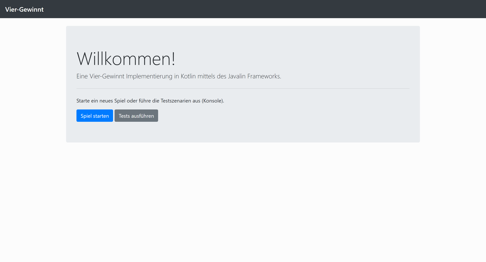
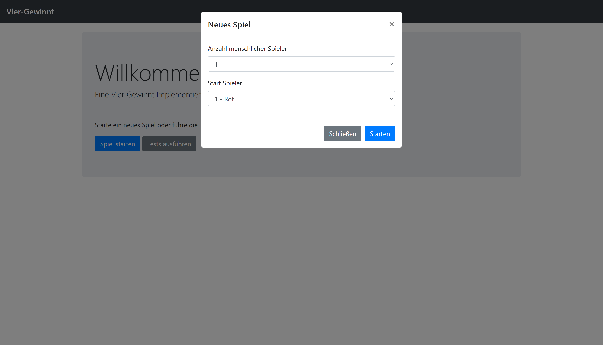
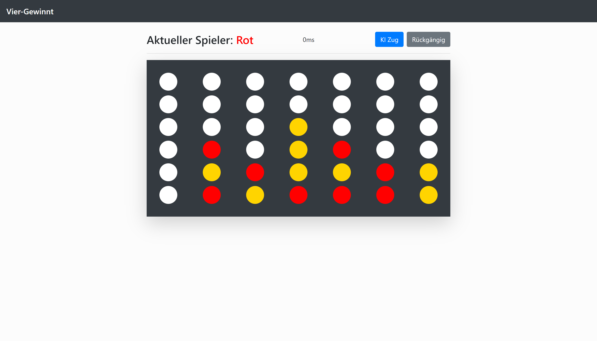
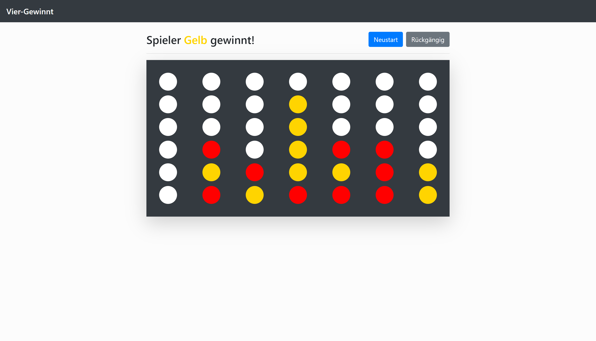

# Vier Gewinnt (PiS, SoSe 2020)

Autor: Lars Wächter, 5280456

Ich habe die Zulassung für PiS im SoSe 2020 bei Herrn Herzberg erhalten.

## Einleitung

### Spielregeln

Die Spielregeln entsprechen dem des klassischen Vier-Gewinnts: Ziel ist es, vier Steine seiner eigenen Farbe, Rot oder Gelb, in einer Reihe (horizontal, vertikal oder diagonal) zu platzieren. Die Spieler wechseln sich dabei gegenseitig ab. Erreicht dies kein Spieler bis alle möglichen Züge (42) gespielt wurden, endet das Spiel Unentschieden.

### Bedienungsanleitung

Auf der Startseite kann der Benutzer entweder ein neues Spiel starten oder die Testdurchläufe ausführen. Diese werden im Abschnitt "Tests (TST)" genauer behandelt.



#### Spielstart

Startet der Benutzer ein neues Spiel, öffnet sich ein Modal, in dem man die Anzahl der menschlichen Spieler auswählt und den Startspieler (Rot oder Gelb) festlegt:

- 1 Spieler: Mensch gegen KI
- 2 Spieler: Mensch gegen Mensch

Im ersten Fall, Mensch gegen KI, ist die Farbe der KI Gelb. Wählt man hierbei also Gelb als Startspieler, beginnt diese das Spiel. Andernfalls der menschliche Spieler.



#### Spielablauf

Der Spielablauf ist immer gleich: beide Spieler spielen abwechselnd ihre Züge indem sie einen Stein in eine freie Spalte des Spielbretts platzieren. Der menschliche Spieler hat dabei folgende Auswahlmöglichkeiten:

1. Er spielt den Zug selbst
2. Er lässt die KI den Zug für sich spielen
3. Er macht einen Zug rückgängig

Nachdem der menschliche Spieler eine Auswahl getroffen hat, spielt daraufhin die KI ihren Zug. Anschließend ist wieder der menschliche Spieler an der Reihe. Hat man bei Spielstart den 2 Spieler Modus ausgewählt, wäre anstelle der KI der zweite Menschliche Spieler am Zug.

**Achtung:** Macht man als menschlicher Spieler einen Zug der KI rückgängig, ist der menschliche Spieler wieder an der Reihe und nicht die KI. Es kommt also sozusagen zu einem Farb- bzw. Spielerwechsel. Andernfalls würde die KI wieder direkt mit einem Zug antworten und es wäre unmöglich, einen einzelnen Zug der KI rückgängig zu machen.

In der Kopfzeile wird der aktuelle Spieler angezeigt. Ist die KI am Zug, wird während der Berechnung des bestmöglichen Zugs eine kleine Ladeanimation angezeigt. Nachdem sie ihren Zug durchgeführt hat, wird die dafür benötigte Zeit in Millisekunden angezeigt. 



#### Spielende

Das Spiel endet, sobald einer der beiden Spieler vier Steine seiner Farbe in einer Reihe (horizontal, vertikal oder diagonal) platziert hat oder kein Züge mehr gespielt werden können. Nach Spielende wird der Gewinner, falls es einen gibt, angezeigt. Der Spieler kann in diesem Fall wie folgt weiter verfahren:

1. Spiel Neustart mit den selben Einstellungen
2. Letzten Zug rückgängig machen



### Dateiübersicht

````
connect-four\build.gradle
connect-four\Readme.md

connect-four\screenshot_01_start.png
connect-four\screenshot_02_neues-spiel.png
connect-four\screenshot_03_spiel-laufend.png
connect-four\screenshot_04_spiel-ende.png

connect-four\src\main\kotlin\connect\four\App.kt
connect-four\src\main\kotlin\connect\four\ConnectFour.kt
connect-four\src\main\kotlin\connect\four\Minimax.kt
connect-four\src\main\kotlin\connect\four\Move.kt
connect-four\src\main\kotlin\connect\four\Server.kt
connect-four\src\main\kotlin\connect\four\Tests.kt

connect-four\src\main\resources\public\index.html
connect-four\src\main\resources\public\assets\index.css
connect-four\src\main\resources\public\assets\index.js

connect-four\src\main\resources\transposition_tables\00_table_0_5.txt
connect-four\src\main\resources\transposition_tables\01_table_6_11.txt
connect-four\src\main\resources\transposition_tables\02_table_12_17.txt
connect-four\src\main\resources\transposition_tables\03_table_18_23.txt
connect-four\src\main\resources\transposition_tables\04_table_24_29.txt
connect-four\src\main\resources\transposition_tables\05_table_30_35.txt
connect-four\src\main\resources\transposition_tables\06_table_36_41.txt
connect-four\src\main\resources\transposition_tables\zobrist_hashes.txt
````

## Spiel-Engine (ENG)

| Feature    | M    | H + S | MC   | eD   | B + I | Summe    |
| ---------- | ---- | ----- | ---- | ---- | ----- | -------- |
| Umsetzung  | 100  | 100   | 100  | 130  | 66.6  |          |
| Gewichtung | 0.4  | 0.3   | 0.3  | 0.3  | 0.3   |          |
| Ergebnis   | 40   | 30    | 30   | 39   | 20    | **159%** |

Die folgenden Abschnitt behandeln die Implementierung der Spiel-Engine sowie Besonderheiten im Code.

### KI-Algorithmus

*Im Code:*

- `Minimax.minimax()`

---

Zur Berechnung des bestmöglichen Zugs, wird der Minimax-Algorithmus verwendet. Dieser rechnet bis zu einer Suchtiefe von einschließlich fünf. Mittels des Parameters `maximize` wird gesteuert, ob man sich gerade in der Rolle des Maximizers oder Minimizers befindet.

Neben Performance-Optimierungen wie einer Datenbank und Symmetrien, welche später behandelt werden, enthält der Algorithmus noch zwei zusätzliche Performance-Optimierungen:

**1. Eine Überprüfung, ob der vorherige Spieler gewonnen hat:**

Eine Abbruchbedingung des Minimax-Algorithmus ist, wenn einer der beiden Spieler das Spiel gewonnen hat. Da in Vier-Gewinnt der Zug eines Spielers nicht zum Sieg des anderen Spielers führen kann, ohne dass dieser noch einen Zug spielt, muss man innerhalb des Algorithmus nicht jedes Mal auf den Sieg beider Spieler prüfen. Es reicht zu überprüfen, ob der vorherige Spieler das Spiel gewonnen hat, da dieser den letzten Zug gespielt hat. Für den aktuellen Spieler spielt der Zug des vorherigen Spielers keine Rolle, weshalb dieser nicht als Sieger geprüft werden muss.

**2. Eine Überprüfung, ob der aktuelle Spieler mit einem der möglichen Züge sofort gewinnen kann:**

Bevor innerhalb des Minimax-Algorithmus alle möglichen Züge bewertet werden, wird einmal über die Liste aller möglichen Züge iteriert und geprüft, ob der aktuelle Spieler mit einem dieser Züge direkt gewinnen kann. Ist dies der Fall, spart man sich die Evaluierung der restlichen Züge und somit Rechenzeit.

### Datenbank

Eine weitere Performance-Optimierung ist das Anlegen einer Datenbank, auch Transposition Tables genannt, bestehend aus bereits evaluierten Spielstellungen und deren bestmöglichen Züge. Eine Datenbank ermöglicht, dass innerhalb des Minimax-Algorithmus nicht jede Stellung neu bewertet werden muss, da diese, solange sie vorhanden ist, aus der Datenbank ausgelesen werden kann.

Anknüpfend wird die Realisierung einer solchen Datenbank beschrieben.

#### Aufbau 

Die komplette Datenbank besteht aus sieben einzelnen Transposition Tables, welche als Textdateien umgesetzt sind. Zu finden sind diese in `src/main/resources/transposition_tables`.

Der Dateiname einer solchen Transposition Table gibt an, wie viele Züge in den Spielen gespielt wurde, deren Evaluierungen in die Tabelle eingetragen wurden. Die Tabelle `00_table_0_5.txt` beinhaltet beispielsweise nur Spielstellungen, bei denen zwischen 0 und 5 Zügen gespielt wurde. Tabelle `01_table_6_11.txt` besteht aus Stellungen mit 6 bis 11 gespielten Zügen.

Zu jedem Zeitpunkt des Spiels weiß man, anhand der Anzahl an gespielten Züge, in welcher Transposition Table die aktuelle Spielstellung zu finden sein könnte. Dies lässt sich wie folgt berechnen: `floor((numberOfPlayedMoves / 6))`.  Der dadurch entstandene Wert (`ConnectFour.storageIndex`) entspricht dem Index der Transposition Table.

#### Transposition Table

*Im Code:*

- `Minimax.Storage` 
- `Minimax.Storage.Record`

---

Eine Transposition Table beinhaltet Spielstellungen und deren Bewertungen für eine jeweils angegebene Anzahl an gespielten Spielzügen. Sie besteht aus mehreren Einträgen nach folgendem Schema:

`#Hash# #Move# #Score# #Player#`

- **Hash**: der Zobrist-Hash der Spielstellung
- **Move**: der bestmögliche Zug (Spalte) für diese Spielstellung
- **Score**: die Bewertung des Zugs
- **Player**: der durchführende Spieler

Beispiel: `1369919444299124995 3 -5727.0 -1`

Ein solcher Eintrag einer Transposition Table wird mit Hilfe der Klasse `Minimax.Storage.Record` repräsentiert. Diese beinhaltet unter anderem die oben genannten Werte als Instanzvariablen.

Die einzelnen Transposition Table werden als Instanz der Klasse `Minimax.Storage` realisiert. Diese kümmert sich um das Lesen und Schreiben der dazugehörigen Textdatei. Außerdem beinhaltet sie eine `HashMap`, welche die Tabelleneinträge als Instanz der Klasse `Minimax.Storage.Record` umfasst.

Insgesamt gibt es sieben Instanzen der Klasse `Minimax.Storage`, für jede Transposition Table eine. Bei Programmstart werden diese Instanzen in dem statische Array `Minimax.Storage.storages` abgelegt. Ausgelesen werden sie wieder mittels der Methode `Minimax.Storage.doStorageLookup()` und des Wertes von `ConnectFour.storageIndex`.

#### Zobrist Hash

*Im Code:*

- `Minimax.Storage`

---

Der Zobrist Hash wird verwendet, um die verschiedenen Spielsituationen als Hashwert abbilden zu können. Wenn keine Kollisionen auftreten, sollte jede mögliche Spielstellung ihren eigenen einzigartigen Zobrist-Hash besitzen. Unter diesem Hashwert werden die Spielstellungen in die Datenbank gespeichert. Dementsprechend werden sie auch wieder mit dem Hash ausgelesen.

##### Vorbereitung

*Im Code:*

- `Minimax.Storage.generateZobristHashes()` 
- `Minimax.Storage.readZobristHashes()`
- `Minimax.Storage.buildZobristTable()`

---

Um den Zobrist Hash einer Spielstellung zu berechnen, müssen zuerst für jede vorhandene Spielfeldzelle und für jeden möglichen Spieler innerhalb einer Zelle, zufällige Zahlen generiert werden (`generateZobristHashes()`). Hierbei wurden Zahlen vom Typ `Long` (64 Bit) genommen. Diese dienen als "Schlüssel". Insgesamt werden 96 solcher Schlüssel erzeugt.

Die erzeugten Schlüssel werden persistent in einer Textdatei abgespeichert: `src/main/resources/transposition_tables/zobrist_hashes.txt`

Bei Programmstart werden die Schlüssel aus der Textdatei geladen und in ein 2D-Array hinterlegt. Dies passiert mit Hilfe der Methode `Minimax.Storage.buildZobristTable()`.

Folgende Tabelle verdeutlicht nochmal den Aufbau: Für jede Zelle des Spielbretts gibt es für beide Spieler eine zufällige Zahl (aus Platzgründen sind diese hier verkürzt dargestellt).

| Spielfeld Zelle | 0            | 1            | 2            | 3            | ...  |
| --------------- | ------------ | ------------ | ------------ | ------------ | ---- |
| Spieler 1       | ... 6389 ... | ... 2725 ... | ... 6402 ... | ... 3206 ... |      |
| Spieler 2       | ... 8625 ... | ... 2805 ... | ... 4394 ... | ... 1259 ... |      |

##### Berechnung

*Im Code:*

- `ConnectFour.calcZobristHash()`

---

Nachdem eine Tabelle mit (pseudo) zufälligen Zahlen erstellt wurde, ist es möglich, den Zobrist-Hash für eine jeweilige Stellung zu berechnen. Hierfür wird für jeden gesetzten Stein beider Spieler der Wert der dazugehörigen Zelle aus der zuvor erzeugten Tabelle (siehe oben) entnommen und per `XOR` Operation miteinander verknüpft. Der dadurch entstandene Wert entspricht dem Zobrist-Hash der jeweiligen Stellung.

**Beispiel:** Spieler 1 hat einen Stein in Zelle #0 und Spieler 2 einen Stein in Zelle #1. Der Zobrist Hash berechnet sich dann wie folgt:   `...6389... XOR ...2805...`.

Ein großer Vorteil dieses Verfahrens ist, dass der Hash nicht nach jedem Spielzug komplett neu berechnet werden muss: Führt ein Spieler einen Zug aus, muss nur der Zobrist-Schlüssel für diesen Spieler und der Spielfeldzelle, in die der Stein gesetzt wurde, aus der Tabelle geladen und per `XOR` Operation mit dem Zobrist-Hash der aktuellen Spielstellung verknüpft werden.

#### Befüllung

*Im Code:*

- `Minimax.Storage.seedByMovesPlayed()`
- `ConnectFour.playRandomMoves()`

---

Um die einzelnen Transposition Tables zu befüllen, wurde eine eigene Methode entwickelt: `Minimax.Storage.seedByMovesPlayed()`. Diese erwartet zwei Parameter:

- `amount: Int` - Anzahl an Datensätzen, die erstellt werden sollen
- `movesPlayed: Int` - Anzahl an gespielten Zügen

Hierbei generiert der Algorithmus ein Spiel, in dem genau `movesPlayed` zufällige Züge gespielt wurden. Zu beachten ist, dass nach diesen Zügen noch kein Gewinner feststeht. Anschließend wird geprüft, ob die hierbei entstandene Spielstellung, oder eine Symmetrie dieser, bereits in der Datenbank vorhanden ist. Ist das nicht der Fall, wird mit Hilfe des Minimax-Algorithmus der bestmögliche Zug für die Stellung berechnet und in die Datenbank eingetragen.

Dieses Verfahren wird genau `amount` mal wiederholt. Es werden also bis zu `amount` viele Datensätze für Spiele bestehend aus `movesPlayed` zufällig gespielten Zügen generiert. 

### Symmetrien

Wie viele andere Spiele auch, beinhaltet Vier-Gewinnt Symmetrien in dessen Spielbrett. Diese entstehen beispielsweise durch Drehungen oder Spiegelungen des Spielbretts. Sie haben die Eigenschaft, dass sie jeweils zu dem selben Spielergebnis führen bzw. die selbe Evaluierung haben. Die Verwendung solcher Symmetrien kann die Anzahl der zu berechnenden Spielstellungen deutlich reduzieren und somit einen großen Einfluss auf die Laufzeit des KI-Algorithmus haben.

#### Arten von Symmetrien

Insgesamt gibt es drei verschiedene Symmetrien.

##### 1. Spiegelung an der mittleren Y-Achse

Bei dieser Symmetrie wird das Spielbrett an der mittleren Y-Achse (Spalte #4) gespiegelt. Es werden die Spielsteine in den jeweiligen Spalten also wie folgt getauscht:

- Spalte 1 <=> 7
- Spalte 2 <=> 6
- Spalte 3 <=> 5
- Spalte 4 <=> 4 (unverändert)

**Hinweis:** Codeseitig beginnen die Spalten bei 0 und gehen bis 6.

Beispiel:

```
Board #1 (best move = 2)

. . . . . . .
. . . . . . .
. . . . . . .
. X . . . . .
. X . O O . .
. X O X O . .

Board #2 (Board #1 gespiegelt) (best move = 6)

. . . . . . .
. . . . . . .
. . . . . . .
. . . . . X .
. . O O . X .
. . O X O X .
```

Ausgehend von einer Board-Stellung wie in `Board #1`, wäre für Spieler X der bestmögliche Zug, einen Stein in Spalte 2 zu werfen. Er hätte damit gewonnen.

Ausgehend von einer Board-Stellung wie in `Board #2`, wäre für Spieler X der bestmögliche Zug, einen Stein in Spalte 6 zu werfen. Er hätte damit ebenfalls gewonnen.

Hierbei ist zu erkennen, dass beide Board-Stellungen zu demselben Ergebnis führen: Spieler X gewinnt.

Hat man nun beispielsweise den bestmöglichen Zug für `Board #1` bereits berechnet und im Speicher vorliegen, kann man im Falle von `Board #2` das Board spiegeln, wodurch man `Board #1` erhält, und den bestmöglichen Zug von `Board #1` aus dem Speicher lesen und übernehmen. Es gilt zu beachten, dass dieser Zug dann ebenfalls gespiegelt werden muss. Aus dem Zug `2` wird also `6`.

Wichtig ist, dass dies nur gilt, wenn man die Board-Stellung in beiden Situationen aus der Sicht desselben Spielers (X) betrachtet. Für Spieler O wären die eben genannten Züge nicht die bestmöglichen.

**Hinweis:** Maßnahmen zur Anpassung eines aus dem Speicher geladenen Zugs und wann diese verwendet werden dürfen, werden im Abschnitt "Processing-Methode" genauer behandelt.

##### 2. Invertierung des Spielbretts

Hierbei werden die einzelnen gesetzten Steine der Spieler invertiert.

- Steine X <=> O
- Steine O <=> X

Beispiel:

```
Board #1 (best move = 2)

. . . . . . .
. . . . . . .
. . . . . . .
. X . . . . .
. X . O O . .
. X O X O . .

Board #2 (Board #1 invertiert) (best move = 2, allerdings für Gegenspieler)

. . . . . . .
. . . . . . .
. . . . . . .
. O . . . . .
. O . X X . .
. O X O X . .
```

Ausgehend von einer Board-Stellung wie in `Board #1`, wäre für Spieler X der bestmögliche Zug, einen Stein in Spalte 2 zu werfen. Er hätte damit gewonnen.

Ausgehend von einer Board-Stellung wie in `Board #2`, wäre für Spieler O der bestmögliche Zug, ebenfalls einen Stein in Spalte 2 zu werfen. Er hätte damit ebenfalls gewonnen.

Hat man nun beispielsweise den bestmöglichen Zug für `Board #1` bereits berechnet und im Speicher vorliegen, kann man im Falle von `Board #2` das Board invertieren, wodurch man `Board #1` erhält, und den bestmöglichen Zug von `Board #1` aus dem Speicher lesen und übernehmen.

Wichtig hierbei ist, dass dies nur gilt, wenn man die Board-Stellung in `Board #2` aus der Sicht des anderen Spielers als in `Board #1` betrachtet. Im Falle von `Board #2` also als Spieler O, da in `Board #1` das Board als Spieler X betrachtet wurde.

##### 3. Spiegelung an der mittleren Y-Achse und Invertierung des Spielbretts

Diese Symmetrie ist eine Kombination aus den ersten beiden. Zuerst wird die Spielstellung gespiegelt und anschließend invertiert.

Beispiel:

```
Board #1 (best move = 2)

. . . . . . .
. . . . . . .
. . . . . . .
. X . . . . .
. X . O O . .
. X O X O . .

Board #2 (Board #1 gespiegelt und invertiert) (best move = 6, allerdings für Gegenspieler)

. . . . . . .
. . . . . . .
. . . . . . .
. . . . . O .
. . X X . O .
. . X O X O .
```

Ausgehend von einer Board-Stellung wie in `Board #1`, wäre für Spieler X der bestmögliche Zug, einen Stein in Spalte 2 zu werfen. Er hätte damit gewonnen.

Ausgehend von einer Board-Stellung wie in `Board #2`, wäre für Spieler O der bestmögliche Zug, einen Stein in Spalte 6 zu werfen. Er hätte damit ebenfalls gewonnen.

Hat man nun beispielsweise den bestmöglichen Zug für `Board #1` bereits berechnet und im Speicher vorliegen, kann man im Falle von `Board #2` das Board spiegeln und invertieren, wodurch man `Board #1` erhält, und den bestmöglichen Zug von `Board #1` aus dem Speicher lesen und übernehmen.

Wie auch im vorherigen Fall, gilt dies nur, wenn man die Board-Stellung in `Board #2` aus der Sicht des anderen Spielers als in `Board #1` betrachtet. Im Falle von `Board #2` also als Spieler O, da in `Board #1` das Board als Spieler X betrachtet wurde. Außerdem muss ebenfalls der Zug gespiegelt werden: `2 <=> 6`.

#### Implementierung der Symmetrien

*Im Code:*

- `ConnectFour.getStorageRecordKeys()`
- `ConncetFour.searchBestMoveInStorage()`

---

Folgender Abschnitt thematisiert die Implementierung der Symmetrien sowie deren Anwendung innerhalb des Minimax-Algorithmus.

Für jede mögliche Spielstellung gibt es vier dazugehörige Hashes, welche aus dem Zobrist-Hash der aktuellen Stellung nach Anwendung der jeweiligen Symmetrie berechnet werden. Basierend auf diesen Hashes wird überprüft, ob eine Stellung in der Datenbank vorhanden ist oder nicht.

##### Hashes

Der erste Hash ist der Zobrist-Hash der aktuellen Spielstellung ohne jegliche angewandte Symmetrie. Unter diesem Hash werden bewertete Spielstellungen in den Transposition-Tables gespeichert. Im Code wird dieser als `storageRecordPrimaryKey` bezeichnet.

Die anderen drei Hashes werden mittels des Zobrist-Hashs nach Anwendung einer Symmetrie auf das Board berechnet:

- Zweiter Hash: 1. Symmetrie (Spiegelung) => Berechnung des neuen Hashs
- Dritter Hash: 2. Symmetrie (Invertierung) => Berechnung des neuen Hashs 
- Vierter Hash: 3. Symmetrie (Spiegelung & Invertierung) => Berechnung des neuen Hashs

Jede Spielstellung besitzt also vier Hashes: Einen für die Ausgangsstellung und drei für die verschiedenen Symmetrien.

##### Verwendung in Minimax

Die einzelnen Hashes werden innerhalb des Minimax-Algorithmus verwendet, um zu überprüfen, ob bereits ein Eintrag unter einem dieser in der Datenbank vorliegt. Ist ein Hash vorhanden, wird der dazugehörige Eintrag aus dem Speicher gelesen und weiterverarbeitet. Hierfür dienen hauptsächlich folgende zwei Methoden:

1. `ConnectFour.getStorageRecordKeys()`

2. `ConnectFour.searchBestMoveInStorage()`

Die erste Methode dient dazu, die jeweiligen Hashes für die aktuelle Spielstellung zu generieren. Sie gibt eine Liste bestehend aus drei Funktionen (für jede Symmetrie eine) zurück. Ruft man eine in der Liste enthaltene Funktion auf, erhält man von dieser ein `Pair<>` bestehend aus dem Hashwert und einer weiteren Funktion (hier "Processing-Methode" genannt), welche benötigt wird, um einen Speicher Eintrag weiterzuverarbeiten. Das `Pair<>` ist in eine zusätzliche Funktion gebettet, da man hierdurch nicht alle möglichen Hashwerte gleichzeitig berechnen muss. In manchen Fällen braucht man nicht alle Hashwerte und man spart sich somit unnötige Berechnungen.

Die zweite Methode wird verwendet, um nach bereits vorhandenen Spielstellungen, einschließlich Symmetrien, in der Datenbank zu suchen. Hierzu ruft sie die erste Methode auf und iteriert über die von ihr erhaltenen Listenelemente. Anschließend wird geprüft, ob einer von den erhaltenen Hashwerten in der Datenbank vorhanden ist und dessen "Processing-Methode" wird aufgerufen.

###### Processing-Methode

Die Processing Methode wird benötigt, da nicht ohne Weiteres ein aus dem Speicher gelesener Eintrag verwendet werden darf. Je nach Symmetrie gibt es verschiedene Kriterien, die erfüllt sein müssen, damit ein Eintrag aus dem Speicher verwendet werden darf.

Die Processing-Methode dient also dazu, um einen Eintrag auf die jeweiligen Kriterien der Symmetrie zu überprüfen. Die Kriterien lauten wie folgt:

- Erster Hash (`storageRecordPrimaryKey`):
  - Keine Symmetrie
  - Wurde ein Eintrag unter diesem Hash gefunden, darf der Eintrag nur verwendet werden,
    wenn der aktuelle Spieler dem des Spielers im Eintrag entspricht
- Zweiter Hash (Spiegelung):
  - Wurde ein Eintrag unter diesem Hash gefunden, darf der Eintrag nur verwendet werden,
    wenn der aktuelle Spieler dem des Spielers im Eintrag entspricht
  - Da hierbei eine Spiegelung stattfand, muss ebenfalls der im Eintrag gespeicherte Zug gespiegelt werden
- Dritter Hash (Invertierung):
  - Wurde ein Eintrag unter diesem Hash gefunden, darf der Eintrag nur verwendet werden,
    wenn der aktuelle Spieler NICHT dem des Spielers im Eintrag entspricht, da die Steine invertiert wurden
  - Zusätzlich muss der Score des Eintrags invertiert werden
- Vierter Hash (Spiegelung & Invertierung):
  - Wurde ein Eintrag unter diesem Hash gefunden, darf der Eintrag nur verwendet werden,
    wenn der aktuelle Spieler NICHT dem des Spielers im Eintrag entspricht, da die Steine invertiert wurden
  - Da hierbei eine Spiegelung stattfand, muss ebenfalls der im Eintrag gespeicherte Zug gespiegelt werden
  - Zusätzlich muss der Score des Eintrags invertiert werden

Ein Hashwert und dessen Processing-Methode werden im Code als `Pair<>` repräsentiert. Der `first` Value entspricht dem Hash und der `second` Value beinhaltet die Processing-Methode.

Um einen Eintrag im Speicher auf die Kriterien eines Hashs zu überprüfen, wird dieser als Argument beim Aufruf der Processing Methode mit übergeben.

Sind alle Kriterien für einen Hash erfüllt, gibt die Processing Methode eine neue Instanz der Klasse `Minimax.Storage.Record` mit angepassten Werten zurück. Sind die Kriterien nicht erfüllt, wird `null` von der Methode zurückgegeben, worauf der ursprünglich im Speicher gefundene Eintrag verworfen und der nächste Hash innerhalb von `ConncetFour.searchBestMoveInStorage()` geprüft wird.

**Beispiel:**

Folgender Code-Ausschnitt (`ConnectFour.getStorageRecordKeys()`) soll das Verfahren nochmal veranschaulichen:

Der `Pair.first` Value entspricht dem ersten Hash einer Spielstellung (ohne jegliche angewandte Symmetrie). Der `Pair.second` Value entspricht der Processing-Methode. Diese überprüft, ob der aktuelle Spieler dem des Spielers aus dem Datenbankeintrag, welcher als Parameter mitgegeben wird, entspricht. Ist dies der Fall, wird der Eintrag zurückgegeben, andernfalls `null`.

````kotlin
val key1 = fun(): Pair<Long, (record: Minimax.Storage.Record<Move>) -> Minimax.Storage.Record<Move>?> =
	Pair(this.storageRecordPrimaryKey, { storageRecord ->
		if (this.currentPlayer == storageRecord.player)
			storageRecord
		else null
	})
````

### Stellungsbewertung

*Im Code:*

- `ConnectFour.mcm()`

---

Damit der Minimax-Algorithmus ein Board aus der Sicht eines beliebigen Spielers bewerten kann, ist eine `evaluate`-Methode notwendig. Im Projekt wurde eine solche Evaluierung mittels der **Monte-Carlo-Methode** umgesetzt.

Hierbei wird ausgehend von einer gegebenen Stellung abwechselnd für jeden Spieler ein zufälliger Zug ausgeführt, bis das schließlich Spiel beendet ist (keine Züge mehr möglich oder Sieg eines Spielers). Dieses Vorgehen wird eine gewünschte Anzahl, hier 200, Mal wiederholt.

Anhand der Anzahl der Gewinne für einen gegebenen Spieler wird ein Score ermittelt, welcher als Evaluationswert für die aktuelle Spielstellung dient. Je höher dieser Wert für den Maximizer bzw. umso niedriger er für den Minimizer ist, desto
besser ist der Score und dementsprechend auch der Zug, der zu der gegebenen Ausgangsstellung führte.

Für die Simulation der 200 Spiele, wurde unter anderem die `kotlinx-coroutines-core` Bibliothek verwendet. Diese ermöglicht die Verwendung von sogenannten "coroutines" in Kotlin. Mittels coroutines können alle Simulation simultan ausgeführt werden, was einen Geschwindigkeitsvorteil bietet.

### Bitboards

*Im Code:*

- `ConnectFour.board`

---

Das Spielbrett ist als Bitboard implementiert. Dies ist ein Array bestehend aus zwei Einträgen, für jeden Spieler einen, welche jeweils Zahlen vom Typ `Long` im Binärformat beinhalten.

Über diese beiden Einträge wird gesteuert, in welchen Zellen die beiden Spieler bereits ihre Steine platziert haben. Hat ein Spieler einen Stein in einer Zelle platziert, wird innerhalb seines Bitstrings der Bit an der Position dieser Zelle zu einer `1` umgewandelt.

Die einzelnen Zellen des Spielbretts befinden sich dabei an den Position `0` bis `47` . Hierbei sind allerdings auch unbenutzte Zellen enthalten, welche nur zum Prüfen auf Vier-in-Reihe benötigt werden. Folgende Darstellung soll den Aufbau nochmal verdeutlichen. Die zusätzlichen unbenutzten Zellen sind hierbei durch `...` gekennzeichnet.

````
		  ...
+---------------------+ 
| 5 12 19 26 33 40 47 |
| 4 11 18 25 32 39 46 |
| 3 10 17 24 31 38 45 |  ...
| 2  9 16 23 30 37 44 |
| 1  8 15 22 29 36 43 |
| 0  7 14 21 28 35 42 |
+---------------------+
````

Innerhalb des Bitstrings befindet sich Zelle `0` an der Position des *least significant bit*, also ganz Rechts.

Beispiel: (weiter linksstehende Bits sind abgeschnitten)

````
... 0000010_0000001
	 col 1	 col 0
````

Hierbei hat der Spieler einen Stein in der Zelle `0` und `8` platziert.

#### Vier-in-Reihe

*Im Code*:

- `ConnectFour.fourInARow()`

---

Um zu überprüfen, ob sich vier Steine eines Spielers in einer Reihe befinden sind folgende Operationen nötig:

- `shr` => Verschiebt die Bits um eine gegebene Anzahl nach rechts
- `and` => Führt eine logische "und-Operation" durch

Dabei wird der Bitstring eines Spielers so weit verschoben, wie der Abstand einer Zelle zur einer benachbarten groß ist:

- Vertikal: 1
- Horizontal: 7
- Diagonal OL nach UR: 6
- Diagonal OR nach UL: 8

Um nun mehre (4) Zellen miteinander zu vergleichen, müssen diese um ein solches Vielfaches von deren Abstand verschoben, dass alle Zellen übereinander liegen.

Hat man nun die einzelnen Zellen durch das Verschieben übereinandergelegt und per `and`-Operation miteinander verglichen, erhält man ein Ergebnis `> 0`, falls vier in einer Reihe sind.

#### Spiegelung

*Im Code:*

- `ConnectFour.mirrorPlayerBoard()`

---

Wie bereits im Abschnitt "Symmetrien" beschrieben, werden Spiegelungen des Spielbretts verwendet, um die Zahl der zu berechnenden Spielstellungen zu reduzieren.

Das Spielbrett wird gespiegelt, indem die einzelnen Spalten gespiegelt werden. Hierbei werden die dazugehörigen Bitblöcke innerhalb des Bitstrings des Spielers nach rechts bzw. links verschoben.

Um zum Beispiel Spalte #2 nach Spalte #6 zu spiegeln und andersherum ist folgende Operation notwendig:

````kotlin
// Spiegel Spalte #2 nach #6
board and 0b1111111_0000000 shl 28

// Spiegel Spalte #6 nach #2
board and 0b1111111_0000000_0000000_0000000_0000000_0000000 shr 28
````

Hierbei ist `board` das Bitboard eines Spielers.

### Interface

*Im Code:*

- `Minimax`

---

Das Minimax Interface ist ein generisches Interface, welches wichtige Attribute und Methoden zur Implementierung von 2-Personen Spielen beinhaltet bzw. vorschreibt:

- Berechnung des bestmöglichen Zugs
- Datenbankverwaltung
- Spielsteuerung (`move, undoMove...`)

Der Interface-Kopf sieht wie folgt aus: `interface Minimax<Board, Move>`. Er erwartet zwei Datentypen als Parameter. Einen für das Spielbrett und einen für die Züge. Da das Interface generisch ist, kann es sehr leicht in andere Spiele implementiert werden. Hierfür sind nur wenige Anpassungen innerhalb des Interface selbst nötig.

Es beinhaltet außerdem noch zwei geschachtelte Klassen: `Storage` und `Storage.Record`. Diese dienen zur Datenbankverwaltung. Siehe dazu Abschnitt "Datenbank".


## Tests (TST)

| Szenario | 1    | 2    | 3    | 4    | 5    | Summe |
| -------- | ---- | ---- | ---- | ---- | ---- | ----- |
| ok       | X    | X    | -    | X    | X    | 0.8   |

Die Tests werden wie folgt ausgeführt:

Alle Tests sind jeweils in einer eigener Funktion innerhalb der Klasse `Tests` implementiert. Dieser werden der Reihe nach aufgerufen. Nach jedem Zug wird das Spielbrett und in welcher Spalte der Stein geworfen wurde ausgegeben.

Die Testszenarien sehen wie folgt aus:

### Test 1

> Die Spiel-Engine kann im nächsten Zug gewinnen (Sichttiefe 1)

Spieler X ist am Zug: Er muss den Stein in Spalte #1 werfen, damit er das Spiel gewinnt.

````
. . . . . . .
. . . . . . .
. . . . . . .
X . . . . . .
X . . . . . .
X . . . O O O
````

### Test 2

> Die Spiel-Engine kann im übernächsten Zug gewinnen (Sichttiefe 3)

Spieler X ist am Zug: Er muss den Stein in Spalte #2 oder #5 werfen, damit er im übernächsten Zug gewinnt.

````
. . . . . . .
. . . . . . .
. . . . . . .
. . . . . . .
. . . . . . O
. . X X . . O
````

### Test 3

> Die Spiel-Engine kann im überübernächsten Zug gewinnen (Sichttiefe 5)

leer

### Test 4

> Die Spiel-Engine vereitelt eine unmittelbare Gewinnbedrohung des Gegners (Sichttiefe 2)

Spieler O ist am Zug: Er muss den Stein in Spalte #1 werfen, andernfalls gewinnt Spieler X im nächsten Zug.

````
. . . . . . .
. . . . . . .
. . . . . . .
X . . . . . .
X . . . . . .
X O O . . . .
````

### Test 5

> Die Spiel-Engine vereitelt ein Drohung, die den Gegner im übernächsten Zug ansonsten einen Gewinn umsetzen lässt (Sichttiefe 4)

Spieler O ist am Zug: Er muss den Stein in Spalte #2 oder #5 werfen, andernfalls gewinnt Spieler X im übernächsten Zug.

````
. . . . . . .
. . . . . . .
. . . . . . .
. . . . . . .
. . . . . . .
. . X X . . O
````

---

Die Testausführung protokolliert sich über die Konsole wie folgt:

**Anmerkung:** Die Spalten werden hier ab 0 gezählt.

````
----- Starting tests -----

Running test #1...
. . . . . . . 
. . . . . . . 
. . . . . . . 
X . . . . . . 
X . . . . . . 
X . . . O O O 

X is playing: 0
. . . . . . . 
. . . . . . . 
X . . . . . . 
X . . . . . . 
X . . . . . . 
X . . . O O O 

Success: Player X has won!
----------------------------------------------

Running test #2...
. . . . . . . 
. . . . . . . 
. . . . . . . 
. . . . . . . 
. . . . . . O 
. . X X . . O 

X is playing: 4
. . . . . . . 
. . . . . . . 
. . . . . . . 
. . . . . . . 
. . . . . . O 
. . X X X . O 

O is playing: 3
. . . . . . . 
. . . . . . . 
. . . . . . . 
. . . . . . . 
. . . O . . O 
. . X X X . O 

X is playing: 5
. . . . . . . 
. . . . . . . 
. . . . . . . 
. . . . . . . 
. . . O . . O 
. . X X X X O 

Success: Player X has won!
----------------------------------------------
Running test #3...
empty
----------------------------------------------
Running test #4...
. . . . . . . 
. . . . . . . 
. . . . . . . 
X . . . . . . 
X . . . . . . 
X O O . . . . 

O is playing: 0
. . . . . . . 
. . . . . . . 
O . . . . . . 
X . . . . . . 
X . . . . . . 
X O O . . . . 

X is playing: 3
. . . . . . . 
. . . . . . . 
O . . . . . . 
X . . . . . . 
X . . . . . . 
X O O X . . . 

Success: Player X has not won!
----------------------------------------------
Running test #5...
. . . . . . . 
. . . . . . . 
. . . . . . . 
. . . . . . . 
. . . . . . . 
. . X X . . O 

O is playing: 1
. . . . . . . 
. . . . . . . 
. . . . . . . 
. . . . . . . 
. . . . . . . 
. O X X . . O 

X is playing: 3
. . . . . . . 
. . . . . . . 
. . . . . . . 
. . . . . . . 
. . . X . . . 
. O X X . . O 

O is playing: 3
. . . . . . . 
. . . . . . . 
. . . . . . . 
. . . O . . . 
. . . X . . . 
. O X X . . O 

X is playing: 2
. . . . . . . 
. . . . . . . 
. . . . . . . 
. . . O . . . 
. . X X . . . 
. O X X . . O 

Success: Player X has not won!
----------------------------------------------
Tests completed! Finished 4 / 5 successfully.
````

## Umsetzung der GUI

Folgender Abschnitt beinhaltet die Umsetzung der GUI sowie die Interaktion zwischen Browser und Server mittels JavaScript.

### Startseite

*Im Code:*

- `src/main/resources/public/index.html`

---

Die Startseite ist sehr einfach gehalten: Der Benutzer hat hier zwei Buttons als Auswahlmöglichkeit:

1. Neues Spiel starten
2. Testdurchläufe starten

#### Neues Spiel

Startet der Benutzer ein neues Spiel, öffnet sich ein Bootstrap-Modal, in dem man die Spieleinstellungen festlegen kann. Nachdem der Benutzer diese festgelegt hat, wird eine neue Instanz der JavaScript Klasse `Game` erstellt, welche die gewählten Einstellungen beinhaltet.

##### Klasse `Game`

*Im Code:*

- `src/main/resources/public/assets/index.js`

---

Die `Game` Klasse dient sowohl als Container für die Spieleinstellungen als auch als Schnittstelle zwischen dem Benutzer und dem Server bzw. Javalin. Sie beinhaltet unter anderem folgende Attribute:

- ID => die zufällig generierte ID des Spiels
- Anzahl Spieler => die Anzahl menschlicher Spieler
- Startspieler => der Startspieler (Rot oder Gelb)

Für jedes Spiel wird eine neue ID bestehend aus 16 zufälligen Buchstaben generiert. Dies ermöglicht es, dass mehrere Spiele gleichzeitig, z.B. von mehreren Tabs oder Rechnern aus, gespielt werden können. Vom Client gesendete HTTP Requests enthalten die jeweilige ID des Spiels, wodurch der Request serverseitig dem jeweiligen Spiel zugeordnet werden kann. Auf der Serverseite werden die einzelnen Spiele mit ihrer ID als `Key-Value` Paar in einer HashMap gespeichert.

Neben den eben genannten Attributen enthält die Klasse auch noch Methoden, um HTTP Requests an den Server zu senden und dort die gewünschten Aktionen auszuführen:

- `function start` => Legt ein neues Spiel mit den gewählten Spieleinstellungen an
- `function restart` => Startet das Spiel mit den selben Einstellungen, allerdings mit einer neuen ID neu
- `function move` => Spielt den vom menschlichen Spieler gewählten Zug
- `function aiMove` => Lässt die KI den bestmöglichen Zug spielen
- `function undoMove` => Macht einen Zug rückgängig

Sobald ein HTTP Request an den Server gesendet wird, werden weitere Eingaben durch das Attribut `isRequestPending` blockiert. Zu Beginn des Requests wird es auf `true` und nach Beendigung auf `false` gesetzt. In der Zwischenzeit können keine weiteren Requests gesendet werden.

Nachdem ein Request beendet wurde, wird ein Ausschnitt des HTML Dokuments mit dem vom Server erhaltenen HTML geupdated.

#### Testdurchläufe

Möchte der Benutzer die Testdurchläufe ausführen, wird ein HTTP Request an den Server übermittelt, welcher diese startet. Weitere Ausgaben erfolgen über die Server-Konsole.

### Spielseite

*Im Code:*

- `ConnectFour.toHtml()`

---

Die Spielseite wird angezeigt, sobald ein neues Spiel gestartet wurde. Das Layout des Spiels wird komplett serverseitig in `ConnectFour.toHtml()` generiert. Es besteht aus zwei Teilen:

1. Metadaten => Spielstatus, Dauer der Zugberechnung, Aktions-Buttons
2. Spielbrett => Vier-Gewinnt Spielbrett

Die Metadaten stehen innerhalb einer Leiste über dem Spielbrett. Dort sind sowohl Infos wie über die Dauer der Zugberechnung, den aktuellen Spieler oder Sieger als auch die Aktionsbuttons zu finden.

Die Event-Listeners zum Ausführen von Aktionen werden ebenfalls serverseitig innerhalb von `ConnectFour.toHTML()` per HTML-Attribut gesetzt. Diese rufen die Methoden in der zu Spielbeginn erstellten `Game` Klasse auf.

### Server Endpunkte

*Im Code:*

- `Server`

---

Die Server Endpunkte dienen als Schnittstelle zwischen dem Client und der Spiel-Engine. Zur Erstellung des HTTP-Servers wurde das Javalin Framework verwendet. Es gibt insgesamt fünf Server Endpunkte, welche vom Client angefragt werden können:

1. `GET /tests` => Führt die Testdurchläufe aus
2. `GET /start/:id` => Startet ein neues Spiel mit der gegebenen ID
3. `GET /:id/move/:column` => Führt einen Zug in der gegebenen Spalte aus
4. `GET /:id/ai-move` => Lässt die KI einen Zug ausführen
5. `GET /:id/undo` => Macht einen Zug rückgängig

Der übergebene Pfadparameter `id` entspricht der ID des jeweiligen Spiels. Er weist den Request dem dazugehörigen Spiel zu.

## Hinweise

- Zu Beginn jedes Abschnitts stehen die dazugehörigen Klassen- bzw. Methodennamen und Attribute aus dem Code
- Zum Versenden von HTTP Requests per JS wird die [fetch-Schnittstelle](https://developer.mozilla.org/de/docs/Web/API/Fetch_API) verwendet
- Möchte man eigene Spielstellungen erstellen, z.B. für eigene Testszenarien, muss lediglich das Array `ConnectFour.board` für die Bitsboards angegeben werden. Das Array `ConnectFour.heights`, welches die "Höhe" der gesetzten Steine pro Spalte beinhaltet, wird automatisch berechnet

## Quellennachweis

- [https://de.wikipedia.org/wiki/Minimax-Algorithmus](https://de.wikipedia.org/wiki/Minimax-Algorithmus)
- [https://en.wikipedia.org/wiki/Negamax](https://en.wikipedia.org/wiki/Negamax)
- [https://github.com/denkspuren/BitboardC4/blob/master/BitboardDesign.md](https://github.com/denkspuren/BitboardC4/blob/master/BitboardDesign.md)
- [https://www.geeksforgeeks.org/minimax-algorithm-in-game-theory-set-5-zobrist-hashing/](https://www.geeksforgeeks.org/minimax-algorithm-in-game-theory-set-5-zobrist-hashing/)
- [https://de.qwe.wiki/wiki/Zobrist_hashing](https://de.qwe.wiki/wiki/Zobrist_hashing)